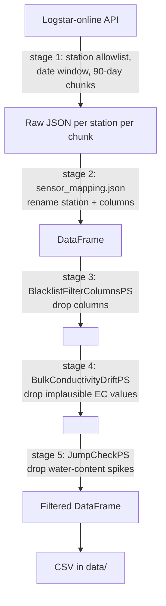

# PatchCrop Publication Data — Filters Applied

Reference for the filtering and transformation applied to the PatchCrop field-experiment
sensor data between download from the Logstar-online API and the published CSV files.

Every value in the published dataset has passed through the five stages below, in order.
Stages 3–5 are *processing steps* (`-ps`), which run in the order given on the command line.

---

## 1. The command

From [`generate_publication_data.md`](./generate_publication_data.md):

```bash
source tmp/load-config-patchcrop.sh
python logstar-receiver.py \
  -m sensor_mapping.json \
  -nodb \
  -co data/ \
  -ps BlacklistFilterColumnsPS columns="battery_voltage signal_strength" \
  -ps BulkConductivityDriftPS treshold_left_to_right=50 threshold_between_depth=80 threshold_max_value=300 \
  -ps JumpCheckPS
```

| Flag | Effect |
|---|---|
| `-m sensor_mapping.json` | Station/column renaming (stage 2). **Silently skipped if the path does not exist** — see [Caveats](#caveats) |
| `-nodb` | No database write; CSV only |
| `-co data/` | CSV output directory. Files are **appended**, so the directory must be empty before a run |
| `-ps …` | Processing steps, applied in the order written |

Selection parameters come from the environment, not the command line — `tmp/load-config-patchcrop.sh`.

> **Note the spelling.** `treshold_left_to_right` is missing its `h`. That is the actual
> keyword in [`BulkConductivityDriftPS.py`](../logstar_stream/processing_steps/BulkConductivityDriftPS.py);
> spelling it correctly makes the argument silently fall back to its default of `50`.

---

## 2. Pipeline



Stages 4 and 5 never drop rows. They replace individual cells with `NA`, so the time axis
stays continuous and a removed measurement is distinguishable from a gap in sampling only
by consulting the change logs in `logs/`.

---

## 3. Stage 1 — Acquisition filters

These decide which data is ever requested. Applied by the API, not locally.

### Station allowlist

`LOGSTAR_STATIONS` — **59 stations**, all soil sensors:

- **36 × `tbs6a_*_BL`** — stationary soil probes, from `tmp/knoten_list.txt`
- **23 × `wcecst_*_BL`** — mobile soil probes, from `tmp/knoten_list_mob.txt`

No weather stations are included. `LOGSTAR_WS1` / `LOGSTAR_WS_BL` were removed from the
config, so `ws1_l1_rtu` and `ws2_l1_rtu` are **not** part of this dataset.

### Date window

```
LOGSTAR_STARTDATE=2021-01-01
LOGSTAR_ENDDATE=2024-12-31
```

Requested in **90-day chunks** (`-c/--chunk-delta`, default `90`). Each chunk is a separate
API call and a separate append to the CSV. Chunking is a transport detail — it does not
filter data — but it does mean a repeated header row per chunk in the output.

### API request parameters

```
https://logstar-online.de/api/{apikey}/{station}/{start}/{end}/{channel}/{datetime}/{geodata}
```

| Parameter | Value | Meaning |
|---|---|---|
| `channel` | `0` | All channels — no channel-level filtering |
| `datetime` | `0` (`LOGSTAR_DAYTIME`) | Single combined `Datetime` column rather than separate `date` + `time` |
| `geodata` | `True` (`LOGSTAR_GEODATA`) | Geodata requested |

---

## 4. Stage 2 — Sensor mapping

Driven by `sensor_mapping.json`. Not a filter, but it determines the column names that
stages 3–5 match against, so **it gates whether those filters do anything at all**.

**Station renaming** — the output filename becomes the `sensor-mapping` key whose `values`
list contains the raw station name.

**Column renaming** — raw Logstar column labels are rewritten via the `measurement-class`
regex and its `position` table into:

```
{measurement}_{side}_{depth}_cm      e.g.  bulk_conductivity_left_60_cm
```

For the `stationary` class this yields 30 measurement columns per station — 5 measurements
(`water_content`, `soil_temperature`, `permittivity`, `bulk_conductivity`,
`pore_water_conductivity`) × 2 sides × 3 depths (30/60/90 cm) — plus `Datetime`.

**Type normalisation**, applied regardless of mapping:

- The Logstar no-value marker `#` is replaced with `NA`
- All non-datetime columns are coerced to numeric (`errors="raise"`)
- `Datetime` is parsed and forced to the first column position

---

## 5. Stage 3 — `BlacklistFilterColumnsPS`

**Removes entire columns.**

```
columns="battery_voltage signal_strength"
```

Both are sensor-housekeeping channels with no scientific value in the published dataset.
They are dropped outright, not nulled.

---

## 6. Stage 4 — `BulkConductivityDriftPS`

**Nulls implausible bulk-conductivity readings.** Operates only on the six
`bulk_conductivity_{left,right}_{30,60,90}_cm` columns; every other measurement passes
through untouched.

The step is skipped entirely for a station unless **all six** columns are present.

Three independent rules, evaluated per row:

| # | Rule | Threshold | Action |
|---|---|---|---|
| 1 | Absolute ceiling | `value > 300` | Null that value |
| 2 | Left/right disagreement | `abs(left − right) > 50` | Null the **higher** of the two |
| 3 | Depth gradient | `shallower + 80 < deeper` | Null the **deeper** value |

Rule 3 is checked only at 60 cm and 90 cm, each against the depth directly above it, and is
skipped when that value was already nulled by rules 1–2. `NA` inputs are always left alone.

The intent is to catch probe drift: an electrode that has lost soil contact reads far higher
than its counterpart on the other side of the plot, or far higher than the soil above it.

Configured thresholds differ from the code defaults:

| Argument | Used here | Code default |
|---|---|---|
| `treshold_left_to_right` | 50 | 50 |
| `threshold_between_depth` | **80** | 60 |
| `threshold_max_value` | **300** | 400 |

Both changed values make the filter *more* permissive than the defaults.

---

## 7. Stage 5 — `JumpCheckPS`

**Nulls short-lived spikes in water content.** Operates only on the six
`water_content_{left,right}_{30,60,90}_cm` columns.

The premise: real soil moisture changes gradually. A reading that jumps sharply and then
returns is sensor error; one that jumps and *stays* is a real event, such as rainfall.

Per station and column, walking forward in time:

1. A rise of **≥ 5** (percentage points) from the previous reading opens a jump. That reading and every one after it is provisionally marked.
2. A fall of **≥ 5** closes the jump — every marked reading is set to `NA`.
3. If the jump lasts **≥ 10 readings** without falling back, the marks are discarded and the data is kept as a genuine change.
4. An `NA` reading resets the tracker.

**These thresholds are not configurable.** `JumpCheckPS` accepts no arguments —
`MINIMUM_JUMP_DIFFER_VALUE = 5.0` and `MAXIMUM_JUMP_DURATION = 10.0` are class constants.
Passing `-ps JumpCheckPS foo=1` has no effect on them.

---

## 8. Output

- One CSV per station in `data/`, named by the sensor-mapping key
- Change logs in `logs/`, one per processing step per station — but see below
- With `-nodb`, nothing is written to PostgreSQL. Without it, rows are upserted with
  `ON CONFLICT DO NOTHING` keyed on `Datetime`, so re-runs never duplicate

---

## Caveats

Verified against the run of 2026-08-20. Each of these affects how the output should be read.
Two have since been fixed in code and are marked as such — they still matter when reading
data or logs produced before that date.

### The mapping path must be correct or all filtering silently stops

`-m sensor_mapping.json` resolves relative to the working directory, and **there is no
`sensor_mapping.json` at the repo root** — the file lives at `mappings/sensor_mapping-patchcrop.json`.
A wrong path is a warning, not an error:

```
could not find sensor-mapping file. Therefore, ignored ...
```

The run then continues with raw Logstar column names, which match nothing in stages 3–5.
Every filter becomes a no-op and the output looks complete but is entirely unfiltered. The
first run of 2026-08-20 failed exactly this way; the second, with
`-m tmp/sensor_mapping-patchcrop.json`, worked. **Always confirm `Found sensor mapping json under: …`
in the log before trusting a run.**

### A missing column aborted the whole blacklist — fixed

**Affects data produced before 2026-08-20.** In
[`BlacklistFilterColumnsPS.py`](../logstar_stream/processing_steps/BlacklistFilterColumnsPS.py)
the `try` wrapped the entire loop rather than each column. When `battery_voltage` was absent,
the exception ended the loop and `signal_strength` was never dropped:

```
Could not filter out column: battery_voltage
```

One missing column silently disabled every column after it in the list. The `try` now sits
inside the loop, so each column is dropped independently. A `Could not filter out column`
line in a log from an earlier run means the columns listed after it survived into the output.

### Drift change-logs accumulated and were mislabelled — fixed

**Affects logs produced before 2026-08-20.** `BulkConductivityDriftPS` cleared
`self.to_change` between stations but never cleared `self.changed`, which is what
`write_log` writes. Each station's log therefore contained all edits from every station
processed before it — **relabelled with the current station's name**.

In the 2026-08-20 logs this shows as sizes growing monotonically through the run, from
7,438 lines for the first station processed to 113,296 for the largest. In those logs only
the first station's is trustworthy, and per-station edit counts must be taken as differences
between consecutive logs rather than read directly.

`self.changed` is now reset after `write_log`, matching `JumpCheckPS`, so each log holds
only its own station's edits. Note this only ever affected the change *logs* — the CSV
values themselves were always correct, because `to_change` was reset properly.

### Change-logs carry no timestamps

`__do_change__` looks for `date`/`time` or `dateTime` columns, but the datetime column is
named `Datetime` (from `--rename-datetime-column`, default `Datetime`). Neither branch
matches, so every entry falls through to the no-timestamp form:

```
 ??? | tbs6a_16_180068_BL -- bulk_conductivity_left_60_cm: changed from 131.0 -> <NA>
```

A nulled value in a CSV cannot currently be traced back to the rule that removed it.

### Five stations are rejected by the API

These return `Wrong station name` and contribute no data:

```
tbs6a_13_180167_BL   tbs6a_16_180115_BL   tbs6a_24_180304_BL
tbs6a_26_180166_BL   tbs6a_27_180076_BL
```

All five are replacement probes listed in `knoten_list.txt`. They are configured and mapped
but unknown to Logstar under these `_BL` names — either the names are wrong or the probes
were never registered.

`tbs6a_14_180108_BL` and `tbs6a_29_180085_BL` are a separate, benign case: the names are
valid but the probes have no data in the first chunk, so they correctly return
`No data found for selected timerange` (for `tbs6a_14_180108_BL` the API reports data
starting 2021-10-04). These recover in later chunks.

### A single network timeout kills the run

`request_data` and `download_data` both call `exit(1)` on failure. There is no retry. The
2026-08-20 run died at 13:15:05 on a timeout for `wcecst_09_BL`, during the very first
90-day chunk:

```
Error when downloading data for station wcecst_09_BL using url https://logstar-online.de/api/…
```

Because CSVs are appended per chunk, an aborted run leaves partial files that look valid.
**Check that the log ends with `bye bye ...` before publishing a dataset.**

### Repeated header rows

Each 90-day chunk appends with `header=True`, so a complete 2021–2024 run leaves roughly 16
header rows interleaved in every CSV. Readers must drop rows where `Datetime == "Datetime"`.

---

## Reproducing

```bash
cd /path/to/logstar-online-stream
rm -f data/*.csv logs/*.log          # appends, so start clean
source tmp/load-config-patchcrop.sh
python logstar-receiver.py \
  -m mappings/sensor_mapping-patchcrop.json \
  -nodb -co data/ \
  -ps BlacklistFilterColumnsPS columns="battery_voltage signal_strength" \
  -ps BulkConductivityDriftPS treshold_left_to_right=50 threshold_between_depth=80 threshold_max_value=300 \
  -ps JumpCheckPS \
  -l run.log
```

Then confirm, in `run.log`:

1. `Found sensor mapping json under: …` — mapping loaded
2. No `Could not filter out column` — blacklist applied in full
3. `bye bye ...` — run completed rather than aborted
